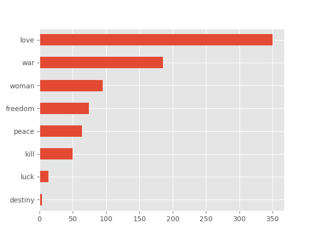

### WordCountPyspark

Simple application for counting and printing a sorted list of occurences from a given set of words. 

For this PoC a set of books from https://www.gutenberg.org were taken. 

The books (Moby Dick, Ulysses, War and Peace) were downloaded as .txt files and the final output was:

